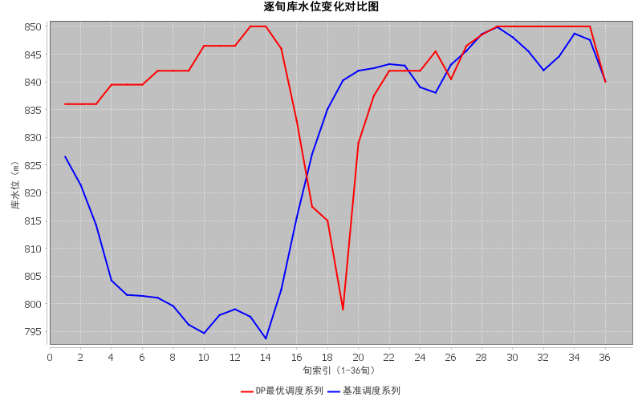
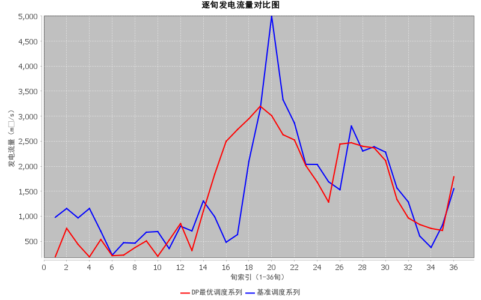
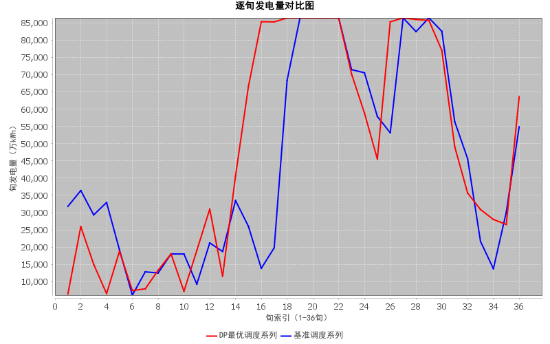
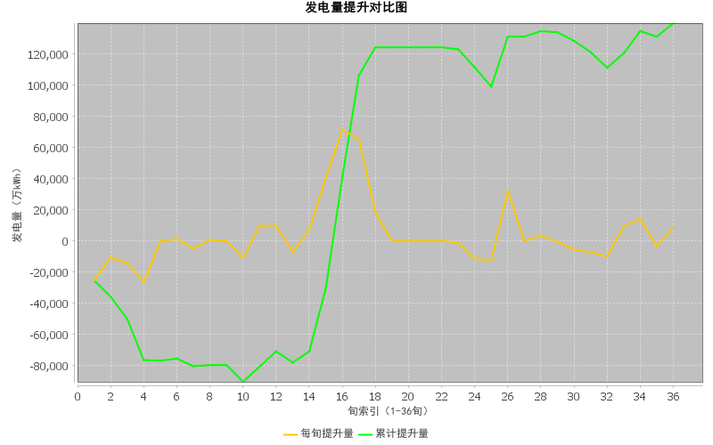

# dp-hydro-single

基于动态规划（Dynamic Programming）的水电站单库调度优化程序：求解单个水电站在一年内的最优调度策略，以最大化年总发电量，并输出逐旬调度序列。研究生阶段学习水资源优化调度的入门实践项目。

## 问题描述与方法

- **研究对象**：单座水电站（水库），已知来水过程、水位库容关系、尾水位流量关系（下游河道行洪能力曲线，由曼宁公式计算）。
- **目标函数**：全年（12 个月、36 旬）总发电量最大。
- **求解方法**：动态规划（逆序递推）。以旬为阶段、库水位为状态变量，将库水位从死水位（790 m）到正常蓄水位（850 m）按固定步长（默认 0.5 m，共 121 个状态）离散，逐旬递推并利用 `prev` 数组回溯最优调度轨迹。

## 数学模型

### 状态与阶段

- 阶段 `k = 1, 2, …, 36`（全年 36 旬）；
- 状态 `Z_k` 为第 `k` 旬末库水位，取离散值 `790 + i × LEVEL_STEP`（`i = 0, …, STATE_COUNT-1`）。

### 水量平衡（状态转移）

旬出库流量由水量平衡反推，库容经水位库容曲线线性插值求得：

```
Q_理论 = W_来水 − (V_末 − V_初) × 1e8 / (10 × 24 × 3600)
```

其中库容单位为亿 m³，流量单位为 m³/s，`10×24×3600` 为一旬的秒数。

### 发电量计算（阶段效益）

```
H_净 = (Z_初 + Z_末) / 2 − Z_尾        # 平均净水头（m）
Z_尾 = f(Q)                            # 按出流插值查尾水位流量关系
N    = A × Q × H_净                    # 平均出力（kW），A = 8.5 为综合出力系数
E    = N × 240 h × 1e-4                # 旬发电量（万kWh）
```

**装机容量约束与弃水**：电站最大出力 3600 MW（360 万 kW），允许的最大发电流量 `Q_max = 3600000 / (A × H_净)`，且不超过出库流量上限。理论流量超出部分记为弃水，发电流量截断至 `Q_max`，旬发电量上限 86400 万 kWh（满发一旬）。

### 递推方程

```
dp[k][j] = max_i { dp[k−1][i] + E(i → j) }
```

不可达状态以 `-Double.MAX_VALUE` 标记；`prev[k][j]` 记录最优前驱状态，求解后自第 36 旬回溯得到全年调度轨迹。

### 约束条件

| 约束 | 取值 | 说明 |
| --- | --- | --- |
| 库水位范围 | 790 ~ 850 m | 死水位 ~ 正常蓄水位 |
| 出库流量 | 188 ~ 5000 m³/s | 下限为最小发电流量，上限为下游河道行洪能力 |
| 汛限水位 | 7、8 月 ≤ 842 m | 主汛期防洪要求（见「已知问题」） |
| 月水位变幅 | ≤ 30 m | 月内各旬末水位极差限制，回溯 `prev` 链逐月校验 |

### 边界条件

- 年初水位 830 m（固定）；
- 年末水位目标 840 m，回溯时在 ±1 m 容差内选取发电量最大的可行状态作为终点。

## 项目结构

```text
├── data/                                   # 输入数据
│   └── hydro_basic_data.xlsx               # 水位库容关系、尾水位流量关系、来水过程、实际水位过程
├── results/                                # 输出结果
│   ├── optimal_dispatch_result.xlsx        # 默认步长 0.5 m 的最优调度结果
│   ├── optimal_dispatch_result_step_0.25.xlsx
│   └── optimal_dispatch_result_step_1.0.xlsx
├── figures/                                # 最优调度 vs 实际调度对比图
│   ├── water_level_comparison.png          # 水位过程对比
│   ├── outflow_comparison.png              # 出流过程对比
│   ├── power_comparison.png                # 发电量对比
│   └── power_increase.png                  # 发电量提升
├── src/main/java/                          # 源码（当前均在默认包，见「已知问题」）
│   ├── Main.java                           # 主入口：读数据 → DP 求解 → 导出 Excel
│   ├── DynamicProgramming.java             # 动态规划核心（递推 + 回溯）
│   ├── ConstraintChecker.java              # 约束校验
│   ├── PowerCalculator.java                # 发电量计算（含装机限制与弃水）
│   ├── ExcelReader.java                    # Excel 数据读取与线性插值
│   ├── ExcelWriter.java                    # 调度结果导出
│   ├── ChartGenerator.java                 # 对比图生成（独立入口）
│   ├── ExcelDataValidator.java             # 输入数据格式校验（独立入口）
│   └── PeriodResult.java                   # 旬结果及基础数据实体类
├── pom.xml
├── LICENSE                                 # MIT
└── README.md
```

## 输入数据格式

输入文件为 `data/hydro_basic_data.xlsx`，共 4 个工作表：

| Sheet | 内容 | 读取规则 |
| --- | --- | --- |
| 1 来水过程 | 36 旬天然来水流量（m³/s） | C2:C37 |
| 2 水位库容 | 整数水位（A 列）× 小数位（第 1 行 0~0.9）→ 库容（亿 m³） | 第 5 行起 |
| 3 尾水位流量 | 整数尾水位（A 列）× 小数位 → 对应流量（m³/s） | 第 5 行起，流量 > 0 有效 |
| 4 实际水位过程 | 实际运行的旬末水位（m），用于对比 | D2:D37 |

运行前可用 `ExcelDataValidator` 校验数据格式是否与读取逻辑匹配。

## 快速开始

### 环境要求

- JDK 17+（`pom.xml` 中 source/target 为 17）
- Maven 3.x
- 依赖：Apache POI 4.1.0（Excel 读写）、JFreeChart 1.5.3（绘图），由 Maven 自动拉取

### 运行

程序内所有路径均为**项目根目录下的相对路径**，请在项目根目录下运行：

```bash
git clone https://github.com/yueyueniao2023/dp-hydro-single.git
cd dp-hydro-single

# 1. DP 求解并导出最优调度结果（results/optimal_dispatch_result.xlsx）
mvn compile exec:java -Dexec.mainClass=Main

# 2. 生成最优调度与实际调度的对比图（figures/）
mvn exec:java -Dexec.mainClass=ChartGenerator

# 3. （可选）校验输入 Excel 的数据格式
mvn exec:java -Dexec.mainClass=ExcelDataValidator
```

运行 `Main` 后控制台会打印年总发电量（万 kWh）。

> Windows 控制台若出现中文乱码，可先执行 `chcp 65001` 切换 UTF-8 代码页；不影响输出文件内容。

### 修改水位离散步长

编辑 `DynamicProgramming.java` 中的 `LEVEL_STEP`（如 0.25 / 0.5 / 1.0），重新编译运行即可。状态数随步长减半而翻倍，计算耗时相应增加。

## 计算结果

默认步长 0.5 m 下，年总发电量 **1,726,495.61 万 kWh（约 172.65 亿 kWh）**。最优调度与实际调度的对比如下：

| 水位过程对比 | 出流过程对比 |
| --- | --- |
|  |  |

| 发电量对比 | 发电量提升 |
| --- | --- |
|  |  |

## 离散步长的收敛性

使用当前代码在三种步长下分别求解，年总发电量如下（均为含弃水逻辑的同口径结果）：

| 步长（m） | 状态数 | 年发电量（万 kWh） | 较粗步长增量（万 kWh） |
| --- | --- | --- | --- |
| 1.0 | 61 | 1,725,780.79 | — |
| 0.5 | 121 | 1,726,495.61 | +714.82 |
| 0.25 | 241 | 1,727,016.17 | +520.56 |

步长越细，可行解空间越大，年发电量单调提升；而每细化一级带来的增量递减（714.82 → 520.56 万 kWh），说明结果正随离散加密趋于收敛。综合精度与计算耗时，0.5 m 是当前较均衡的选择。

## 已知问题与后续改进

- **包结构与工程配置**：所有类位于默认包（无 `package` 声明）；`pom.xml` 的 groupId/artifactId 仍为脚手架默认值，缺少 exec 插件显式声明。
- **汛期约束与题设不一致**：设计意图为 5–7 月汛期执行汛限水位，当前代码实现为 7、8 月（见 `ConstraintChecker.java`），待确认修正。
- **弃水电量取值偏乐观**：弃水旬的发电量直接取满发上限 86400 万 kWh，而非按截断后流量精确计算。
- **末水位边界放松为 ±1 m**：为保证可行解存在；后续可尝试严格匹配并检查可行性。
- **资源管理**：Excel 读写未使用 try-with-resources，异常路径存在资源泄漏风险。
- **代码清理**：存在被整体注释的废弃类（`FinalDemo.java`）、调试输出与疑问标记注释。
- **缺少单元测试**：`src/test` 目前为空，计划补充插值函数与水量平衡换算的测试。

## License

[MIT](LICENSE)
