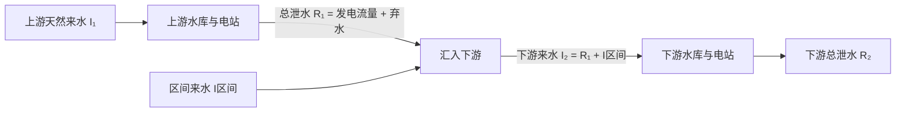

# 串联双库调度：从两个水量平衡到二维状态动态规划

这个示例在原单库程序旁新增 `cascade` 包，研究对象是**上游水库 → 下游水库**。优化目标是两座电站在整个调度期的总发电量最大。两库一起求解，保留上下游调度的相互影响。

**全部参数、曲线和来水都是人工合成数据，无任何实站来源。** 数据规模刻意保持较小，方便阅读、修改和核算；结果不代表实际电站运行建议。默认 36 旬按 2025 非闰年日历设置时长，只使用该年的天数，不使用该年的实测来水。

## 1. 先运行一次

需要 JDK 17+、Maven 3.x。在项目根目录执行：

```bash
mvn compile exec:java "-Dexec.mainClass=cascade.CascadeMain"
```

输出文件为 `results/cascade/dispatch.csv`，控制台打印两站发电量、期末水位和水量平衡残差。CSV 为 UTF-8 文本，可通过 Excel 的“从文本/CSV”功能导入，也可用 Python 读取。

```bash
# 指定输入目录和输出文件；先复制示例目录，再修改副本进行实验。
mvn compile exec:java "-Dexec.mainClass=cascade.CascadeMain" "-Dexec.args=data/cascade results/cascade/dispatch.csv"

# 查看参数说明
mvn compile exec:java "-Dexec.mainClass=cascade.CascadeMain" "-Dexec.args=--help"

# 运行自动化检查（含小规模穷举对照）
mvn test
```

双库程序本身只使用 Java 标准库，未引入新的运行时依赖。它可以独立于原单库的 Excel 输入运行；整个 Maven 项目仍保留原有 Excel/绘图依赖。

如果暂时没有 Maven，可以只用 JDK 运行双库程序。下面是 PowerShell 命令（仍在项目根目录）：

```powershell
New-Item -ItemType Directory -Force target/cascade-classes | Out-Null
javac -encoding UTF-8 -d target/cascade-classes src/main/java/cascade/*.java
java -cp target/cascade-classes cascade.CascadeMain
```

这个方式无需下载 POI 或 JFreeChart；自动化测试仍使用 Maven。使用 Bash 时，将第一行换成 `mkdir -p target/cascade-classes` 即可。

默认示例的运行结果如下，均为合成数据的教学数值：

| 指标 | 结果 |
| --- | --- |
| 上游总发电量 | 665719.574 MWh |
| 下游总发电量 | 516654.625 MWh |
| 梯级总发电量 | **1182374.199 MWh = 118237.420 万 kWh** |
| 上游、下游期末水位 | 210 m、105 m |
| 最大单库水量平衡残差 | 约 `2.05 × 10⁻⁸ m³` |
| 最大上下游耦合残差 | 约 `1.42 × 10⁻¹⁴ m³/s` |

残差反映浮点运算舍入误差，不是实际蒸发、渗漏或传播损失。末位数值可能因运行环境略有差异。

## 2. 理清上下游耦合



最关键的一行是：

```java
downstreamInflow = upstreamRelease + intervalInflow;
```

这里用上游的**总泄水**，包括过机发电的水和弃水。弃水只是没有经过上游机组，仍然会流入下游；不能在上游水量平衡之后“删除”弃水，也不能只把上游发电流量传给下游。

若先单独优化上游，再把它的出流交给下游，上游可能选择对自身有利、但造成下游弃水或低水头的方案。串联联合优化比较的是 `上游发电量 + 下游发电量 + 以后各期最优收益`，因此应把两库水位共同放进状态。

自动化测试还构造了一个独立的小例子说明这种差别。3 个 1 天时段，上下游各 3 个水位，初末固定为中间水位；上游来水为 `20、80、20 m³/s`，区间来水均为 `3 m³/s`。上游机组最大流量 100 m³/s，下游仅 35 m³/s。其它参数见 `CascadeDpTest` 中的联合/顺序优化对照测试。

| 求解方式 | 上游路径（m，包含初始水位） | 上游电量（MWh） | 梯级电量（MWh） |
| --- | --- | --- | --- |
| 先让上游自身最优，再优化下游 | 101 → 102 → 102 → 101 | 289.680 | 1258.476 |
| 两库联合优化 | 101 → 101 → 102 → 101 | 279.480 | 1367.512 |

联合方案让上游少发 10.2 MWh，却使梯级多发约 109.036 MWh。测试通过穷举两库全部 81 组完整路径核对结果。这个小例子与默认年度示例使用不同数据，目的在于直接展示“局部最优不等于全局最优”。

## 3. 单位先统一

| 量 | 程序单位 | 换算或说明 |
| --- | --- | --- |
| 水位、尾水位、水头 | m | 各高程采用同一基准 |
| 库容 `V` | 亿 m³ | 进入水量平衡前乘 `1e8` |
| 入流、总泄流、发电流量、弃水 | m³/s | 每期平均流量 |
| 时长 | 天、秒、小时 | `seconds = days × 86400`；`hours = days × 24` |
| 出力 `N` | MW | `A × Q × H / 1000` |
| 发电量 `E` | MWh | `N × hours` |
| 原单库文档中的发电量 | 万 kWh | **1 MWh = 0.1 万 kWh**；MWh 除以 10 |

`A=8.5` 是使 `A × Q × H` 得到 kW 的综合出力系数，包含效率近似，不是 8.5% 的效率。不要把算得的 kW 直接当成 MW。

不同月份的下旬可能是 8、10 或 11 天。本例使用真实日历的旬天数，全年共 365 天，不能固定使用 `36 × 10 = 360` 天。

## 4. 给定两库期初、期末水位，算一次转移

第 `t` 期已知两库期初水位 `Z₁⁰, Z₂⁰`，枚举两库期末水位 `Z₁¹, Z₂¹`。根据水位—库容曲线线性插值得到对应库容 `V₁⁰, V₁¹, V₂⁰, V₂¹`。

用本期秒数 `Δt` 反推上游总泄流：

```text
R₁ = I₁ + (V₁⁰ − V₁¹) × 1e8 / Δt
```

随后确定下游入流，再求下游总泄流：

```text
I₂ = R₁ + I区间
R₂ = I₂ + (V₂⁰ − V₂¹) × 1e8 / Δt
```

蓄水时 `V末 > V初`，总泄流小于入流；放水时相反。每站的水量平衡应满足：

```text
V末 × 1e8 = V初 × 1e8 + (I − R) × Δt
```

代码将不满足约束的转移剔除，而不是把不合法的泄流截断成上下限。直接截断总泄流会破坏已选定的期末库容与水量平衡。

### 一个可以手算的耦合例子

设本期 10 天，上游天然来水 200 m³/s，区间来水 30 m³/s，尝试：

- 上游从 210 m 升至 212 m：库容由 1.80 升至 2.02 亿 m³。
- 下游从 105 m 升至 106 m：库容由 0.90 升至 1.012 亿 m³。

于是：

```text
Δt = 10 × 86400 = 864000 s
R₁ = 200 − (2.02 − 1.80) × 1e8 / 864000 = 174.537037 m³/s
I₂ = 174.537037 + 30 = 204.537037 m³/s
R₂ = 204.537037 − (1.012 − 0.90) × 1e8 / 864000 = 191.574074 m³/s
```

两库合计蓄水 `0.332 亿 m³`，也等于 `(200 + 30 − 191.574074) × 864000`。在整个梯级的水量平衡里，上游泄流是内部流量，因此抵消。这可以帮助检查是否误把区间来水重复计算。

这个例子只说明一次转移如何计算，不代表 DP 最后一定选择这组水位。

## 5. 发电流量与弃水怎样区分

对每个水库分别计算：

```text
Z尾 = tailwaterCurve(R)                      // 按总泄流查尾水位
H = (Z初 + Z末) / 2 − Z尾 − headLoss          // 本期平均净水头
Q装机 = installedPowerMw × 1000 / (A × H)
Q发电 = min(R, maxTurbineFlow, Q装机)
Q弃水 = R − Q发电
N = A × Q发电 × H / 1000                     // MW
E = N × hours                               // MWh
E梯级 = E上游 + E下游
```

发电流量受机组最大过流能力和装机容量共同限制；剩余总泄流作为弃水。上述发电公式适用于 `H > 0`。毛水头（平均库水位减尾水位）不大于 0 且需要正泄流时，由于本模型无抽水设施，该转移不可行；若毛水头为正、扣除机组水头损失后净水头不大于 0，则机组不发电，总泄流全部计为弃水。默认数据始终具有正水头。

尾水位按**总泄流**查询，因为弃水也流入尾水河道。模型没有增加单独的溢洪道泄流上限或泄洪建筑物水力曲线，`maxRelease` 是本站总泄流上限。

本例假设上游尾水位仅由上游总泄流决定，不受下游库水位顶托。若以后研究紧邻的梯级电站，需要把上游尾水关系改为包含下游水位的函数，仍可在同一联合状态转移内计算。

## 6. 二维状态与四重枚举

设上游离散水位有 `Nu` 个，下游有 `Nd` 个。在每个时间边界，状态是两库水位的组合 `(i, j)`，共有 `Nu × Nd` 个联合状态。

本例：上游 200～220 m、步长 2 m，共 11 个水位；下游 100～110 m、步长 1 m，共 11 个水位。因此每个时间边界共有 **121 个联合状态**。

定义：

```text
F[t][i][j] = 完成前 t 期、到达联合状态 (i,j) 的最大累计发电量
```

初始仅允许 `(210 m, 105 m)`：

```text
F[0][初始上游索引][初始下游索引] = 0
其它状态 = 负无穷（不可达）
```

递推公式：

```text
F[t+1][i1][j1] = max over (i0,j0) {
    F[t][i0][j0] + E上游(i0→i1) + E下游(j0→j1; 上游泄流)
}
```

只对可达前态、满足全部约束的转移取最大值。理解代码时，可先记住下面四层水位枚举：

```text
for 每一期 t:
    for 上游期初索引 i0:
        for 下游期初索引 j0:
            跳过不可达的联合前态
            for 上游期末索引 i1:
                计算上游水量平衡、上游收益、下游入流
                for 下游期末索引 j1:
                    计算下游水量平衡和收益
                    如本次累计收益更大：更新后态收益，记录联合前驱 (i0,j0)
```

“四重”指四个水位索引；外面还有时期循环。核心实现可能缓存某些计算以减少重复工作，数学意义不变。

**前向递推**从第一期累计到最后一期；**逆向回溯**从指定末态沿前驱走回初态。逆向回溯只是恢复最优路径，不要和逆序 Bellman 递推混淆。

初始水位和目标末水位都必须精确落在网格上。本例末水位严格等于 `(210 m, 105 m)`，不在目标附近挑一个“差不多”的末态。目标末态不可达时明确报错，应检查数据、约束和离散步长，而不是输出一条未闭合的路径。

## 7. 约束如何进入转移

| 约束 | 实现含义 |
| --- | --- |
| 死水位与最高水位 | 所有边界水位在给定网格范围内 |
| 每期水位上限 | `inflows.csv` 的上限同时约束本期期初和期末 |
| 单期水位变化 | `abs(Z末 − Z初) <= maxLevelChange` |
| 总泄流上下限 | 水量平衡反推的总泄流必须在 `minRelease..maxRelease` 内 |
| 机组最大流量、装机容量 | 限制发电流量，其余为弃水 |
| 水头 | 正泄流要求毛水头为正；净水头不为正则不发电、全部弃水 |
| 初末水位 | 固定初态、严格指定末态 |

第 19～24 期（7、8 月）水位上限是上游 214 m、下游 107 m。由于约束同时作用于期初和期末，进入第 19 期之前就需要完成预泄。用两端约束近似整期水位上限，隐含期内水位变化按线性过程理解；模型并未分辨日内洪峰。

`maxLevelChange` 是**相邻边界**的水位变化约束，不是原单库代码中的“一个月内各旬水位极差”。如果约束依赖更早历史，仅记录当前两库水位可能不再充分，需要扩展状态（例如加入月内已出现的最高、最低水位），不能只回溯当前最优路径后丢弃，否则可能破坏 DP 最优性。

## 8. 输入文件与修改方式

`data/cascade/` 恰有 6 个文件：

| 文件 | 内容 |
| --- | --- |
| `reservoirs.properties` | 两库名称、水位范围和步长、初末水位、泄流范围、机组流量、装机容量、出力系数、水头损失、单期水位变幅 |
| `upstream-level-storage.csv` | 上游水位—库容曲线 |
| `downstream-level-storage.csv` | 下游水位—库容曲线 |
| `upstream-release-tailwater.csv` | 上游总泄流—尾水位曲线 |
| `downstream-release-tailwater.csv` | 下游总泄流—尾水位曲线 |
| `inflows.csv` | 期号、天数、上游天然来水、区间来水、两库本期水位上限 |

读取规则：UTF-8，允许空行和以 `#` 开头的注释行；CSV 表头必须与示例精确一致，数据行列数固定，数值须有限，不接受 `NaN`、`Infinity`。CSV 仅包含数值，不使用带引号或包含逗号的文本字段。曲线横坐标严格递增；水位—库容曲线库容严格递增；尾水位随流量不下降。曲线必须覆盖对应计算范围，不靠越界外推补数。错误消息包含文件路径和行号。

参数文件使用普通 `upstream.字段名=值`、`downstream.字段名=值`，可直接写中文名称。为便于检查，禁止重复键、未知键、缺失键、反斜杠转义和跨行参数；不需要把中文转成 `\uXXXX`。

`period` 从 1 连续编号，`days` 必须大于 0。程序本身不硬编码 36 期，可以改成其它期数，但总发电量应按实际时长解释。

## 9. 怎样阅读输出与源码

CSV 每期一行。公共列提供期号、天数、天然来水、区间来水和水位上限；`upstream_` / `downstream_` 前缀分别对应两库：

| 列后缀 | 含义 |
| --- | --- |
| `start_level_m`, `end_level_m` | 期初、期末水位 |
| `start_storage_1e8m3`, `end_storage_1e8m3` | 期初、期末库容 |
| `inflow_m3s`, `release_m3s` | 入流、总泄流 |
| `turbine_flow_m3s`, `spill_m3s` | 发电流量、弃水 |
| `tailwater_m`, `head_m`, `power_mw` | 尾水位、净水头、平均出力 |
| `energy_mwh` | 本站本期发电量 |
| `balance_residual_m3` | 本站水量平衡残差，浮点误差下应接近 0 |

另外 `period_total_energy_mwh` 是两站本期合计，`cumulative_total_energy_mwh` 是累计合计。检查每行 `downstream_inflow_m3s = upstream_release_m3s + interval_inflow_m3s`，可直接看出耦合关系；`release = turbine_flow + spill` 可检查水量是否分配完整。

建议按以下顺序阅读：

1. `PeriodInput`、`Reservoir` 和 `LinearCurve`：理解单位、数据结构和插值。
2. `StationOperation`、`HydroPhysics`：理解固定两端水位如何唯一确定总泄流，以及发电量如何计算。
3. `CascadeDp`：沿“联合初态 → 枚举双库转移 → 累计两站收益 → 更新前驱 → 严格末态 → 回溯”阅读。
4. `CascadeDataReader`、`CascadeMain`、`CascadeCsvWriter`：理解程序怎样连接输入、求解和输出。
5. `src/test/java/cascade/`：看水量守恒、弃水传递、严格末态和穷举对照如何验证。

## 10. 精度、复杂度与后续实验

朴素计算量为 `O(T × Nu² × Nd²)`。示例最多枚举 `36 × 11⁴ = 527076` 个四水位组合，实际会跳过许多不可达或不满足约束的候选。若两库步长都减半，水位状态数近似翻倍，朴素工作量约增加 **16 倍**。联合水位组合的增长是多库 DP 的“维数灾”。

优化器找到的是**离散网格和本模型内的最优解**，不保证等于连续水位问题的最优解。只有在细网格包含粗网格、其它参数和约束完全一致时，粗网格的所有方案才也属于细网格可行集，此时细化后的最优值理论上不会下降。比较时应同时记录发电量、耗时、两库水位与弃水过程。

可以依次尝试：

1. 将全部区间来水改为 0，观察下游来水如何完全取决于上游泄水。
2. 调低上游装机容量，观察上游弃水仍进入下游并可能继续发电。
3. 收紧下游泄流上限，观察上游方案如何配合下游限制；某些参数会导致不可行，这也是正常结果。
4. 将上游步长改为 1 m、下游改为 0.5 m，在初末水位仍落网格的前提下比较精度和运行时间。
5. 改变末水位目标，注意“年末少蓄一些水换取更多当年电量”的边界影响，避免比较不同末库容下的发电收益。

本示例暂不包含：水流传播时滞、区间损失、蒸发渗漏、机组启停与爬坡、随水头变化的效率曲线、负荷/电价、电网约束、风光出力、抽水蓄能或电化学储能。无时滞假设意味着本期上游平均泄水全部在本期进入下游。综合出力系数固定，但水头随库水位和尾水位变化。未来引入风光储时，先明确目标变为总发电量、收益、弃风弃光最小还是负荷跟踪，再增加相应决策变量、状态与功率平衡，避免只在现有收益上机械相加。
